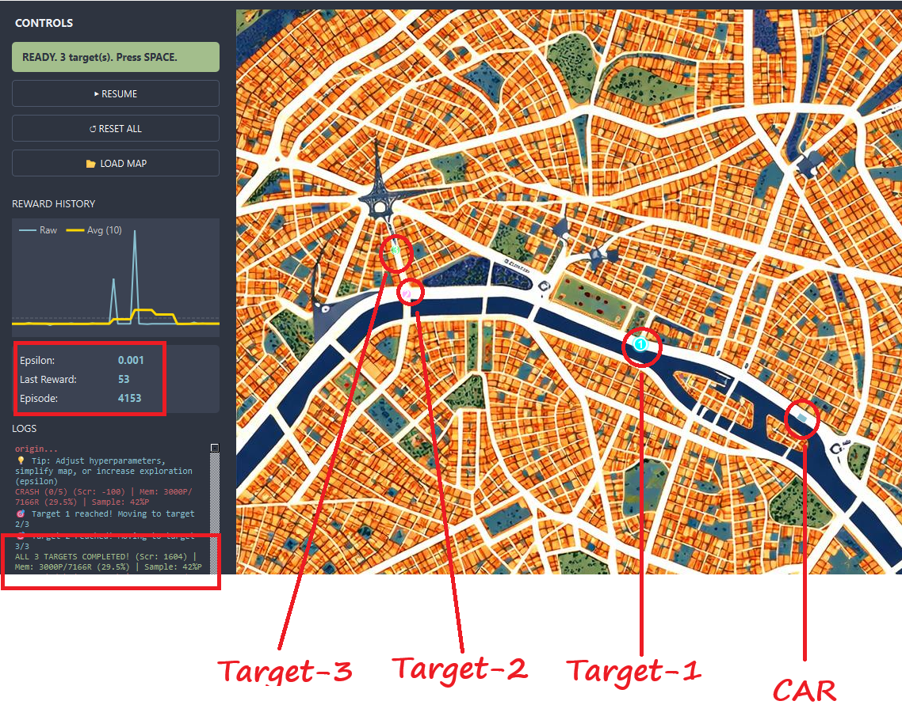

# Autonomous Car Navigation - Summary

## Overview
In this assignment, I worked on fixing and training a self-driving car using Deep Q-Network (DQN) reinforcement learning. The original codebase had several parameters intentionally misconfigured ("FIX ME" sections), which prevented the car from learning effectively. 

## Approach & Fine-tuning
I went through the `citymap_assignment.py` file and fine-tuned the critical parameters. My focus was on:

1.  **Physics Parameters**: I adjusted the sensor distance and angles to give the car a better "view" of its surroundings. I also tweaked the speed and turn angles to ensure the car's movement physics were realistic and controllable.
2.  **RL Hyperparameters**: Values like `BATCH_SIZE`, `GAMMA` (discount factor), and the learning rate were corrected to standard stable ranges for DQNs. This ensured the network could actually learn from its experiences without diverging.

## Observations & Results
After applying the fixes, I ran the simulation to observe the agent's learning progress:

*   **At 5,000 Episodes**: The car started showing significant improvement. It had learned the basics of avoiding immediate obstacles and was able to successfully **cross the first checkpoint**.
*   **At 20,000 Episodes**: The policy had matured significantly. The car could navigate more complex segments of the map, successfully **crossing the 3rd checkpoint** and ultimately reaching the goal: the **Eiffel Tower**.

## Conclusion
The experiments confirm that with the corrected physics and hyperparameter settings, the DQN agent is capable of learning a robust navigation policy for the given city map.

